# Rapport du Workshop Prog&Algo S1
- [Rapport du Workshop Prog\&Algo S1](#rapport-du-workshop-progalgo-s1)
  - [Exercices](#exercices)
    - [Exo 1: Ne garder que le vert](#exo-1-ne-garder-que-le-vert)
    - [Exo 2: Échanger les canaux](#exo-2-échanger-les-canaux)
    - [Exo 3: Noir \& Blanc](#exo-3-noir--blanc)
    - [Exo 4: Négatif](#exo-4-négatif)
    - [Exo 5: Dégradé](#exo-5-dégradé)
    - [Exo 6: Miroir](#exo-6-miroir)
    - [Exo 7: Image bruitée](#exo-7-image-bruitée)
    - [Exo 8: Rotation de 90°](#exo-8-rotation-de-90)
    - [Exo 9: RGB Split](#exo-9-rgb-split)
    - [Exo 10: Luminosité](#exo-10-luminosité)
    - [Exo 11: Disque](#exo-11-disque)
      - [Exo 11.2: Cercle](#exo-112-cercle)
      - [Exo 11.3: Animation](#exo-113-animation)
      - [Exo 11.4: Rosace](#exo-114-rosace)
    - [Exo 12: Mosaïque](#exo-12-mosaïque)
      - [Exo 12.2: Mosaïque miroir](#exo-122-mosaïque-miroir)
    - [Exo 13: Glitch](#exo-13-glitch)
    - [Exo 14: Tri de pixels](#exo-14-tri-de-pixels)
    - [Exo 15: Dégradés de couleur dans l'espace Lab](#exo-15-dégradés-de-couleur-dans-lespace-lab)
    - [Exo 16: Fractale de Mandelbrot](#exo-16-fractale-de-mandelbrot)
    - [Exo 17: Tramage](#exo-17-tramage)
    - [Exo 18: Normalisation de l'histogramme](#exo-18-normalisation-de-lhistogramme)
    - [Exo 19: Vortex](#exo-19-vortex)
    - [Exo 20: Convolutions](#exo-20-convolutions)
      - [Exo 20.2: Autres effets](#exo-202-autres-effets)
      - [Exo 20.3: Filtres séparables](#exo-203-filtres-séparables)
      - [Exo 20.4: Différences de gaussiennes](#exo-204-différences-de-gaussiennes)
    - [Exo 21: K-means](#exo-21-k-means)
    - [Exo 22: Filtre de Kuwahara](#exo-22-filtre-de-kuwahara)
    - [Exo 23: Diamond Square](#exo-23-diamond-square)
      - [Exo 23.2: Colorier la height map](#exo-232-colorier-la-height-map)

## Exercices

### Exo 1: Ne garder que le vert

### Exo 2: Échanger les canaux

### Exo 3: Noir & Blanc

### Exo 4: Négatif

### Exo 5: Dégradé

### Exo 6: Miroir

### Exo 7: Image bruitée
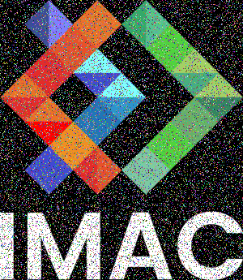

### Exo 8: Rotation de 90°

Pour les exercices 1 à 8, simple à faire 

### Exo 9: RGB Split
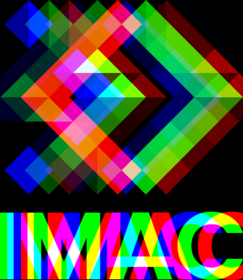

Le plus difficile est de déterminer le nombre de pixel de différence pour obtenir une image similaire à celle de l'exercice.

### Exo 10: Luminosité
Original:

Après éclaircissement:

Après assombrissement:

### Exo 11: Disque
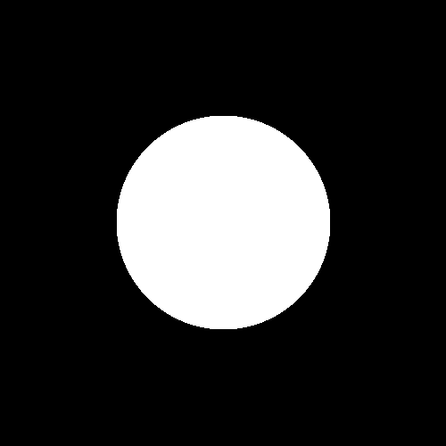

#### Exo 11.2: Cercle
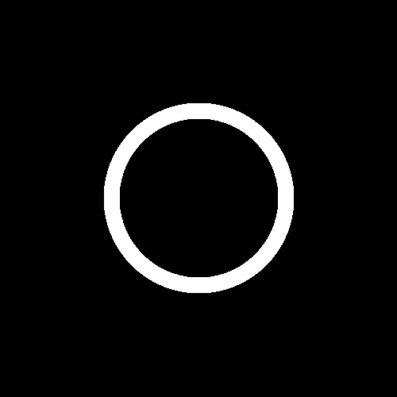

#### Exo 11.3: Animation

#### Exo 11.4: Rosace
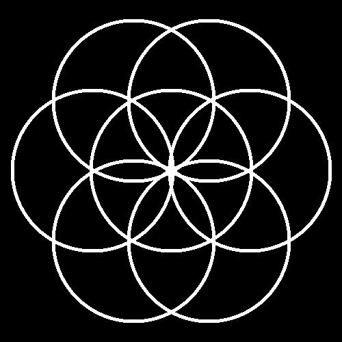

Difficulté principale: Arriver à déterminer correctement les centres des cercles extérieures.
(La rosace n'est bien formée que pour une image de taille 500x500.)

### Exo 12: Mosaïque
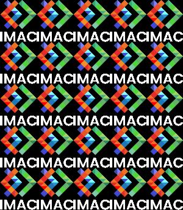

Facile grâce à l'indice

#### Exo 12.2: Mosaïque miroir
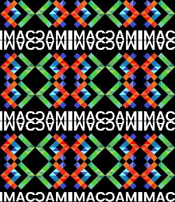

Demande un peu de préparation.

### Exo 13: Glitch
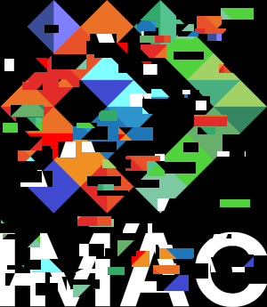

Même principe que l'image bruitée sauf qu'on échange des blocs de pixels.

### Exo 14: Tri de pixels
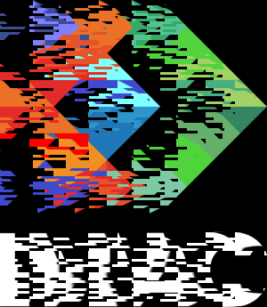

Difficile, l'image ci-dessus est le résultat le plus proche que j'ai pu obtenir.

### Exo 15: Dégradés de couleur dans l'espace Lab
Dégradé RGB:
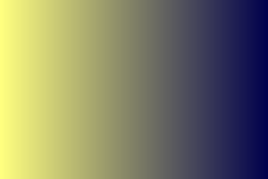

Dégradé OKLab: (pas de différence car pour le moment la fonction de conversion est cassé)

La conversion de RGB vers Lab et inversement entraîne des problèmes de types pour le moment irrésolu dans mon code.

### Exo 16: Fractale de Mandelbrot

C'est beau

### Exo 17: Tramage

Une fois l'article compris c'est facile.

### Exo 18: Normalisation de l'histogramme
Original: 

Après transformation:

### Exo 19: Vortex
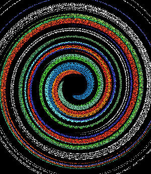

Certains pixels ne sont pas transférés de l'image original au vortex.

### Exo 20: Convolutions
Flou à partir d'une grille en 3x3:

#### Exo 20.2: Autres effets
Emboss:

Outline:

Sharpen:

#### Exo 20.3: Filtres séparables
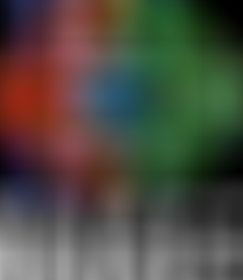

#### Exo 20.4: Différences de gaussiennes

Image obtenu en faisant la différence entre un l'image non modifié et la même image floutée par une grille de 10x10.s

Difficulté principale: Choisir le flou de chacune des images.

### Exo 21: K-means 
Original:

2 couleurs:

3 couleurs:

16 couleurs:

Remarque: Avec de la chance, faire tourner une fois l'algorithme suffit pour obtenir un résultat satisfaisant.

### Exo 22: Filtre de Kuwahara

La chose la plus longue à faire est de faire les cas particuliers.

### Exo 23: Diamond Square
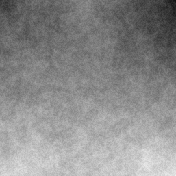

Simple une fois que les premières étapes de l'algorithme sont comprises.

#### Exo 23.2: Colorier la height map
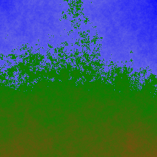 

